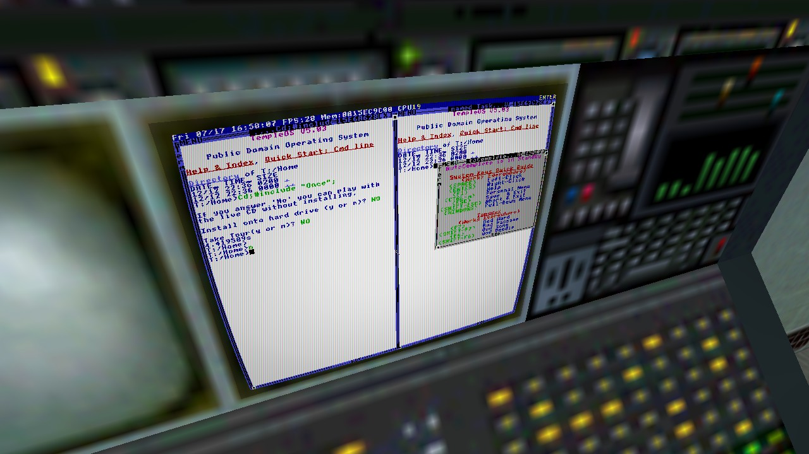

# TempleOS-HL1

Run a full, live [TempleOS](https://templeos.org) instance on a working
computer monitor inside **Half-Life 1** (GoldSrc). Walk up to the terminal,
press use, and you're driving Terry Davis's 640x480 16-color operating system,
running for real inside Black Mesa. Not a video, not a mockup. HolyC at your
fingertips.


## How it works

TempleOS is 64-bit and `hl.exe` is a 32-bit process, so you can't embed the OS
in the game. Instead it runs beside the game and is streamed in:

```
 QEMU (64-bit child process)               Half-Life client.dll (this mod)
 ┌───────────────────────────┐   VNC/RFB   ┌────────────────────────────────┐
 │ TempleOS live CD, headless│  loopback   │ tiny RFB client (Raw encoding) │
 │ -vnc 127.0.0.1:0          │◄───────────►│ streams 640x480 RGBA per frame │
 │ public-domain ISO         │             │ draws it as a quad on a monitor│
 └───────────────────────────┘             │ +use = drive it, keyboard to VM│
                                           └────────────────────────────────┘
```

1. **VM.** QEMU boots the TempleOS live-CD ISO headless with a loopback VNC
   server. The mod auto-answers the boot prompts so it lands on the desktop.
2. **Bridge.** A background thread speaks just enough RFB (RFC 6143, Raw
   encoding, no auth) to pull TempleOS's framebuffer as RGBA every frame.
3. **Render.** From the client's world-draw pass the mod uploads that frame to
   its own GL texture and draws it as a flat quad pinned to a monitor surface.
   It uses the mod's own texture and geometry, so it never touches the map's
   shared, tiled textures. The screen stays crisp with zero bleed onto walls. A
   GLSL fragment shader then gives it curved glass, scanlines and an RGB shadow
   mask, so it reads as a real CRT instead of a flat sprite. If the driver has
   no GL 2.0, the shader is skipped and the plain quad is drawn.
4. **Interaction.** Walk up to the console and press **X** to sit down and
   type, which only works when you are close; your keyboard then routes straight
   to TempleOS over RFB. Press **Z** to blow the panel up fullscreen so it is
   readable, from anywhere in the room, and **F10** to stand back up. TempleOS is
   keyboard-driven by design, so the keyboard is all you need.
5. **Sound (opt-in).** Set `toshl_sound 1` and reload the map to route
   TempleOS's PC-speaker output (the beeps and the hymns) to the host over SDL
   audio. It is off by default, and if the audio backend can't start headless
   the VM simply launches silent, so sound can never hold TempleOS back.



By default the panel auto-locks onto a specific Black Mesa control-room monitor
in `c1a0`, so TempleOS is just there when you arrive. Set `toshl_fixed 0` to aim
at any surface and drop it there instead.

## Controls

No key binding needed; the mod claims these keys directly.

| Key / command         | What it does                                     |
|-----------------------|--------------------------------------------------|
| X                     | sit down and type (only when near the terminal)  |
| Z                     | toggle fullscreen zoom (works from anywhere)     |
| F10                   | stop typing                                      |
| `toshl_size N`        | panel width in game units                        |
| `toshl_aspect N`      | panel height / width (0.75 = 4:3)                |
| `toshl_shiftr N`      | slide the panel right (negative = left)          |
| `toshl_shiftu N`      | slide the panel up (negative = down)             |
| `toshl_fwd N`         | push the panel off the wall toward you           |
| `toshl_fixed 0`       | drop the baked spot; aim and +use to place it    |
| `toshl_crt 0`         | turn the CRT shader off (curvature/scanlines/mask)|
| `toshl_crt_curve N`   | barrel curvature amount (0 = flat glass)         |
| `toshl_crt_scan N`    | scanline depth (0 = none)                        |
| `toshl_crt_mask N`    | RGB shadow-mask depth (0 = none)                 |
| `toshl_crt_bezel N`   | curvature-border opacity (1 = black, 0 = clear)  |
| `toshl_sound 1`       | opt-in PC-speaker audio (reload the map to apply) |

## Using TempleOS

TempleOS is keyboard-driven and case-sensitive; its shell is a live HolyC JIT,
so statements end with `;`. Once you have pressed **X** to type and **Z** to
zoom, a few commands get you moving:

| Command | What it does |
|---------|--------------|
| `Dir;` | list the current folder |
| `Cd("::/Demo");` | change folder (`::/` is the drive root; `Cd("..");` goes up) |
| `#include "::/Demo/Games/Castle/Castle"` | compile and run a program (no extension needed) |
| `"Hello from Black Mesa\n";` | a bare string prints itself |
| `Print("%d\n", 2 + 2);` | formatted print |

Worth trying: the games and demos under `::/Demo/Games` and `::/Demo/Graphics`
(run `Dir;` there to see what your ISO ships), and TempleOS's built-in oracle,
"God's Word", from the menu that Terry believed let God speak through the RNG.
Most demos exit with **Esc**.

## Repo layout

```
src/rfb/         minimal RFB/VNC client (Raw encoding), no external deps
src/glhook/      GL rendering: world-space quad + fullscreen zoom (+ discovery)
src/vmproc/      QEMU launcher (Job Object: the VM dies with the game)
src/client/      orchestrator: RFB to render, placement, input, keymap
src/sdk_glue/    Half-Life SDK glue: entry points, +use edge, window subclass
integration/     patch + script that wire the mod into the HL SDK client build
tools/           rfb_probe: prove the VM pipeline works before touching HL
vm/              setup script; TempleOS.iso + qemu_path.txt live here
```

## Build

You need Visual Studio 2019 (v142 toolset, 32-bit MSVC), QEMU, and a checkout
of the Half-Life SDK. Use the **steam_legacy** branch: the 25th-Anniversary
update replaced GoldSrc's classic OpenGL path, and the GL rendering this mod
relies on only works on the pre-anniversary (steam_legacy) engine.

The mod is not a standalone binary; its sources compile into the SDK's client
library. So the flow is: check out the SDK, check out this repo next to it, and
run one script that adds the mod sources and the entry-point splices to the SDK
project.

```powershell
# 1. Half-Life SDK, steam_legacy branch (this mod is developed against edbae22)
git clone https://github.com/SamVanheer/halflife-updated
git -C halflife-updated checkout steam_legacy

# 2. This repo, NEXT TO the SDK (same parent folder), folder name kept, submodule included
git clone --recursive https://github.com/aravpanwar/half-life-templeos
#   git submodule update --init   # if you forgot --recursive

# 3. Fetch the TempleOS ISO and point the mod at your QEMU install
powershell -ExecutionPolicy Bypass -File half-life-templeos\vm\setup.ps1

# 4. Wire the mod into the SDK client project (adds sources + the three splices)
powershell -ExecutionPolicy Bypass -File half-life-templeos\integration\apply-integration.ps1 -SdkPath halflife-updated
```

Then open `halflife-updated\projects\vs2019\projects.sln` in Visual Studio
2019 and build **hl_cdll** in **Release / Win32**. The post-build step installs
`client.dll` into the mod folder named in `halflife-updated\filecopy.bat`. Launch
Half-Life on the steam_legacy branch as a local singleplayer / `-insecure`
session and load a map with a monitor, such as `c1a0`.

The integration is a single git patch (`integration/halflife-updated.patch`);
the script just applies it, and `-Revert` undoes it. It touches only three SDK
files (`cdll_int.cpp`, `input.cpp`, `tri.cpp`) at tagged splice points, plus the
project file and `filecopy.bat`.

Optional: sanity-check the VM pipeline with no game involved.

```powershell
cd half-life-templeos
cmake -B build -A Win32
cmake --build build --config Release --target rfb_probe
build\Release\rfb_probe.exe 127.0.0.1 5900 frame.ppm   # open frame.ppm
```

## Roadmap

- Persist a writable TempleOS data drive so files survive between sessions
- Terminals placed in more maps
- Mouse support ([#1](https://github.com/aravpanwar/half-life-templeos/issues/1)).
  TempleOS is PS/2-only, and QEMU confines a PS/2 mouse driven over VNC to a
  small region; making the cursor track fully would need an absolute pointing
  device TempleOS does not have a driver for.

## Licensing

- **This mod's code:** see [LICENSE](LICENSE).
- **TempleOS:** public domain (Terry A. Davis). The ISO may be redistributed.
- **QEMU:** GPL, *not bundled*. Kept as a separate process the mod talks to
  over a socket, so nothing GPL is linked into the HL SDK-derived DLLs. You
  point the mod at your own QEMU install.
- **MinHook:** BSD-2, SDK-compatible.
- **Half-Life:** you must own it; assets are not distributed here.

## Credits

In memory of Terry A. Davis (1969-2018). *"An idiot admires complexity, a
genius admires simplicity."*
